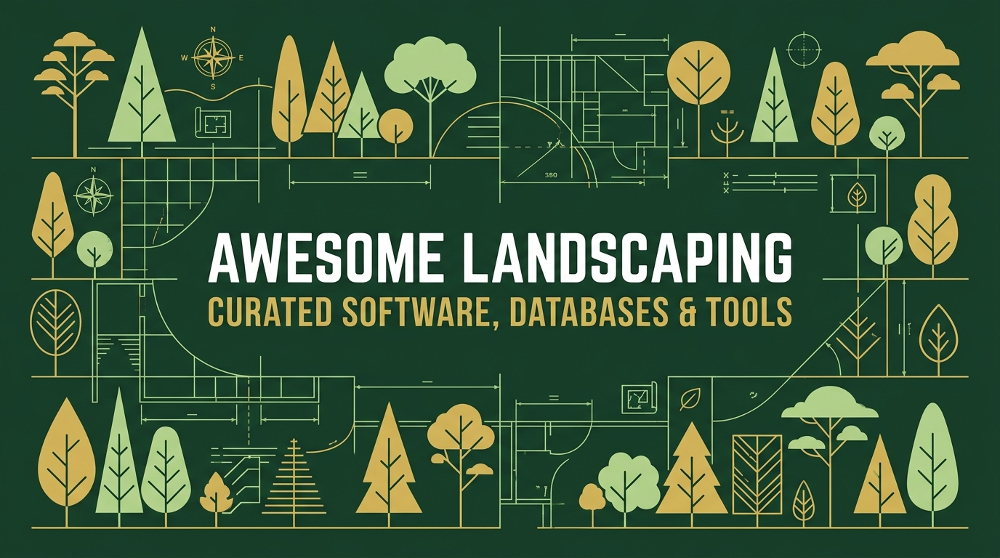

# Awesome Landscaping 

> A curated list of paid software, open-source tools, plant databases, and design applications for landscaping and lawn care businesses.

Landscaping businesses span several specialized roles, from field operations and site bidding to complex 2D/3D design and plant selection. This repository compiles the best tools available—ranging from industry-standard paid suites to flexible open-source projects—to help landscaping companies grow and run efficiently.

---

## Contents
- [Business Management & FSM](#business-management--fsm)
- [Landscape & Garden Design (2D/3D & CAD)](#landscape--garden-design-2d3d--cad)
- [Estimating, Takeoff & GIS](#estimating-takeoff--gis)
- [Scheduling & Crew Management](#scheduling--crew-management)
- [Customer Relationship & Communication (CRM)](#customer-relationship--communication-crm)
- [Plant Databases & Botanical APIs](#plant-databases--botanical-apis)
- [Inventory & Asset Management](#inventory--asset-management)
- [Nursery & Greenhouse Management](#nursery--greenhouse-management)
- [Contributing](#contributing)

## Business Management & FSM

All-in-one platforms for scheduling, dispatching, invoicing, routing, and field operations management.

*   [Arborgold](https://www.arborgold.com) - Software for tree care, landscaping, and nurseries, featuring inventory bidding and scheduling modules. [Commercial]
*   [ArboStar](https://arbostar.com) - Enterprise-grade management platform built specifically for arborists and tree service operations. [Commercial]
*   [Aspire](https://www.youraspire.com) - Enterprise-grade landscape business management platform for mid-to-large commercial and residential companies. [Commercial]
*   [CompanyCam](https://companycam.com) - GPS-tagged photo documentation and team collaboration tool built for field contractors. [Freemium]
*   [HeyBloom](https://heybloom.ai) - AI-powered scheduling, marketing, and client manager built for landscaping. Includes a free plan. [Freemium]
*   [Jobber](https://getjobber.com) - All-in-one client management, estimation, scheduling, invoicing, and crew dispatching software. [Commercial]
*   [Kickserv](https://www.kickserv.com) - Simple scheduling, dispatching, and invoicing software for service contractors. [Freemium]
*   [Lawn Buddy](https://lawnbuddy.com) - Simple mobile app for lawn care scheduling, estimates, and business operations. [Commercial]
*   [LawnPro](https://www.lawnprosoftware.com) - Business software for lawn care and landscaping professionals, featuring estimates, scheduling, and billing. [Commercial]
*   [LMN (Landscape Management Network)](https://golmn.com) - Budgeting, estimating, scheduling, and timesheets built specifically for landscape business growth. [Commercial]
*   [Service Autopilot](https://www.serviceautopilot.com) - High-volume automation, scheduling, routing, and invoicing software for lawn care companies. [Commercial]
*   [Yardbook](https://www.yardbook.com) - Comprehensive landscaping business software featuring billing, scheduling, and estimating. Includes a free plan. [Freemium]

---

## Landscape & Garden Design (2D/3D & CAD)

Tools for visual planning, drafting, spatial rendering, and showing designs to customers.

*   [AutoCAD Land F/X](https://www.landfx.com) - Advanced CAD plug-in that streamlines planting, irrigation, and hardscape design. [Commercial]
*   [Blender](https://www.blender.org) - Free and open-source 3D creation suite, excellent for high-end landscape modeling and architectural rendering. [Open Source]
*   [FreeCAD](https://www.freecad.org) - Open-source parametric 3D modeller, useful for precise hardscape engineering and custom outdoor designs. [Open Source]
*   [HeyBloom Studio](https://studio.heybloom.ai) - Free AI-powered design tool to visualize landscape designs instantly from photos of yards. [Free]
*   [IrriPro](https://www.irripro.com) - Standalone hydraulic software for designing, calculating, and optimizing micro-irrigation systems. [Commercial]
*   [PRO Landscape](https://prolandscape.com) - Professional photo imaging, CAD drafting, and 3D design software for landscape contractors. [Commercial]
*   [Pro Contractor Studio](https://procontractorstudio.com) - Standalone CAD software designed for residential and commercial irrigation layout and design. [Commercial]
*   [Realtime Landscaping Architect](https://www.ideaspectrum.com) - Professional landscape design software for creating 2D plans and 3D walkthroughs. [Commercial]
*   [SketchUp Free](https://www.sketchup.com/plans-and-pricing/sketchup-free) - Versatile browser-based 3D modeling tool, popular for modeling yards and garden structures. [Freemium]
*   [Sweet Home 3D](http://www.sweethome3d.com) - Open-source interior and exterior design application for drawing house and garden plans. [Open Source]
*   [Vectorworks Landmark](https://www.vectorworks.net/landmark) - The premier CAD and BIM software for landscape design, site planning, and GIS integration. [Commercial]

---

## Estimating, Takeoff & GIS

Tools for calculating material quantities, blueprint measurements, and analyzing site geography.

*   [Active Takeoff](https://www.activetakeoff.com) - Easy-to-use digital construction takeoff and estimation software. [Commercial]
*   [Google Earth Pro](https://www.google.com/earth/about/versions/#earth-pro) - Free desktop software for detailed satellite imagery, measurements, and site evaluation. [Free]
*   [OpenStreetMap](https://www.openstreetmap.org) - Collaborative open-world map, useful for exporting vector geographic data. [Open Source]
*   [QGIS](https://www.qgis.org) - A free and open-source Geographic Information System (GIS) to create, edit, and visualize geospatial data. [Open Source]
*   [Stack Takeoff](https://www.stackct.com) - Cloud-based takeoff and estimating tool for measuring blueprints and plans. [Commercial]

---

## Scheduling & Crew Management

Timesheets, crew tracking, and roster coordination tools for managing crews in the field.

*   [Clockify](https://clockify.me) - Free-to-use time tracking and timesheet tool for tracking crew hours. [Freemium]
*   [Homebase](https://joinhomebase.com) - Employee scheduling, timesheets, and team communication software. [Freemium]
*   [Odoo](https://www.odoo.com) - Open-source suite of business apps, including timesheets, project management, and HR. [Open Source]
*   [Shifton](https://shifton.com) - Online employee scheduling, shift planning, and roster software. [Freemium]

---

## Customer Relationship & Communication (CRM)

Lead tracking, customer communications, marketing automation, and customer support desks.

*   [Chatwoot](https://www.chatwoot.com) - Open-source customer engagement suite for real-time support and communications. [Open Source]
*   [HubSpot](https://www.hubspot.com) - Free CRM with marketing hubs for managing leads and client interactions. [Freemium]
*   [SuiteCRM](https://suitecrm.com) - Highly customizable open-source CRM for tracking leads, customers, and communications. [Open Source]

---

## Plant Databases & Botanical APIs

Databases for looking up plant specifications, care guidelines, zone requirements, and botanical data.

*   [Perenual](https://perenual.com) - Comprehensive plant database API with care guidelines, watering schedules, and disease lookup. [Freemium]
*   [Permapeople](https://permapeople.org) - Open-source, crowd-sourced database for permaculture, companion planting, and edible crops. [Open Source]
*   [Pl@ntNet](https://plantnet.org) - Image-based plant identification app and database. [Free]
*   [Trefle API](https://trefle.io) - A global botanical database API providing structural data for plants and trees. [Free]
*   [USDA Plants Database](https://plants.usda.gov) - Standard botanical resource maintained by the United States Department of Agriculture. [Free]

---

## Inventory & Asset Management

Tools for tracking physical inventory (plants, mulch, fertilizer) and machinery assets (trucks, mowers, tools).

*   [InvenTree](https://inventree.org) - Open-source inventory management system with stock control and manufacturing workflows. [Open Source]
*   [Snipe-IT](https://snipeitapp.com) - Open-source IT asset management, highly adaptable for tracking landscaping tools, trucks, and equipment. [Open Source]

---

## Nursery & Greenhouse Management

Inventory management, logistics, and sales software designed specifically for wholesale nurseries and commercial growers.

*   [ARGO Software](https://argosoftware.com) - Inventory management, logistics, and sales software designed specifically for wholesale nurseries and growers. [Commercial]
*   [Spruce](https://www.ecisolutions.com/lumber-and-building-materials/spruce) - Enterprise retail management and POS system optimized for garden centers and nursery supply yards. [Commercial]

---

## Contributing

Contributions are welcome! Please read the [Contributing Guidelines](file:///Users/michaelortali/.gemini/antigravity/scratch/awesome-landscaping/CONTRIBUTING.md) to get started on submitting improvements or additions.

---

## License

This project is licensed under the [MIT License](file:///Users/michaelortali/.gemini/antigravity/scratch/awesome-landscaping/LICENSE).
